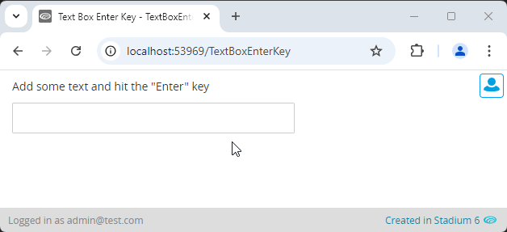

# TextBox Enter Event

Using the "Enter" key to submit a value in a TextBox is a common interaction pattern. This module allows you to define a script to run when the cursor users enter some text in a TextBox and hit the "Enter" key. 



# Version
1.0 - initial

# Setup

## Application
1. Check the *Enable Style Sheet* checkbox in the application properties

## Global Script
1. Create a Global Script called "EnterKeyPressEvent"
2. Add the input parameters below to the Global Script
   1. Callback
   2. TextBoxClass
3. Drag a *JavaScript* action into the script
4. Add the Javascript below unchanged into the JavaScript code property
```javascript
/* Stadium Script v1.0 https://github.com/stadium-software/utils-textbox-enter-event */
let scope = this,
    classname = ~.Parameters.Input.TextBoxClass,
    elParent = document.querySelector("." + classname);
let ev = "keypress";
let callback = ~.Parameters.Input.Callback;
elParent.addEventListener(ev, function (e) {
    if (e.keyCode === 13) {
        scope[callback]();
    }
});
```

## Page
1. Drag a *TextBox* to the page
2. Add a unique classname to the *TextBox* classes property (e.g. keypress-textbox)

## Custom Event Handler Page Script
1. Create a script under the page and name it anything you like (e.g. EnterKeyPressCallback)
2. Add actions to the script to process the event

## Page.Load
1. Drag the "EnterKeyPressEvent" script into the Page.Load event handler
2. Provide values for the script input parameters
   1. Callback: The name of the page script (e.g. EnterKeyPressCallback)
   2. TextBoxClass: The unique classname you added to the TextBox (e.g. keypress-textbox)

## Working with Stadium Repos
Stadium Repos are not static. They change as additional features are added and bugs are fixed. Using the right method to work with Stadium Repos allows for upgrading them in a controlled manner. How to use and update application repos is described here 

[Working with Stadium Repos](https://github.com/stadium-software/samples-upgrading)